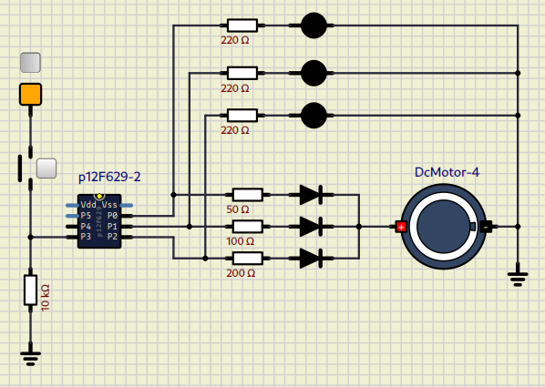

# Circuit 1 - DC-Motor

**Date:** August 10th, 2025
**Author:** Rodrigo (rodrigoCodDev)

This circuit represents a basic activation of DC Motor with PIC12F629.

**Ports:**
- **GPO (output):** High level (1)
- **GP1 (output):** Intermediate level (2)
- **GP2 (output):** Low level (3)
- **GP3 (input):** it controls the motor operating level (0/1/2/3)

