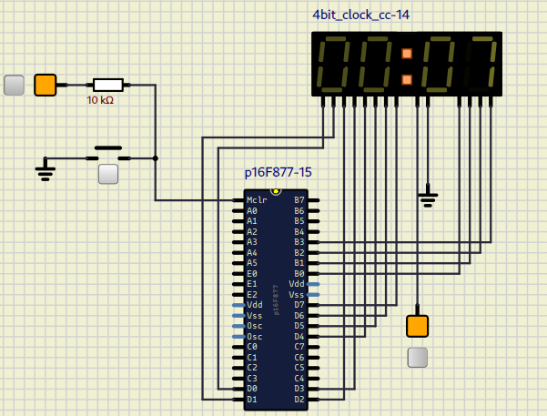

# Circuit 2 - Timer

**Date:** August 10th, 2025
**Author:** Rodrigo (rodrigoCodDev)

This circuit represents a timer with PIC16F877.

**Ports:**
- PORTD as output: display segments
- PORTB as output: digit selection

